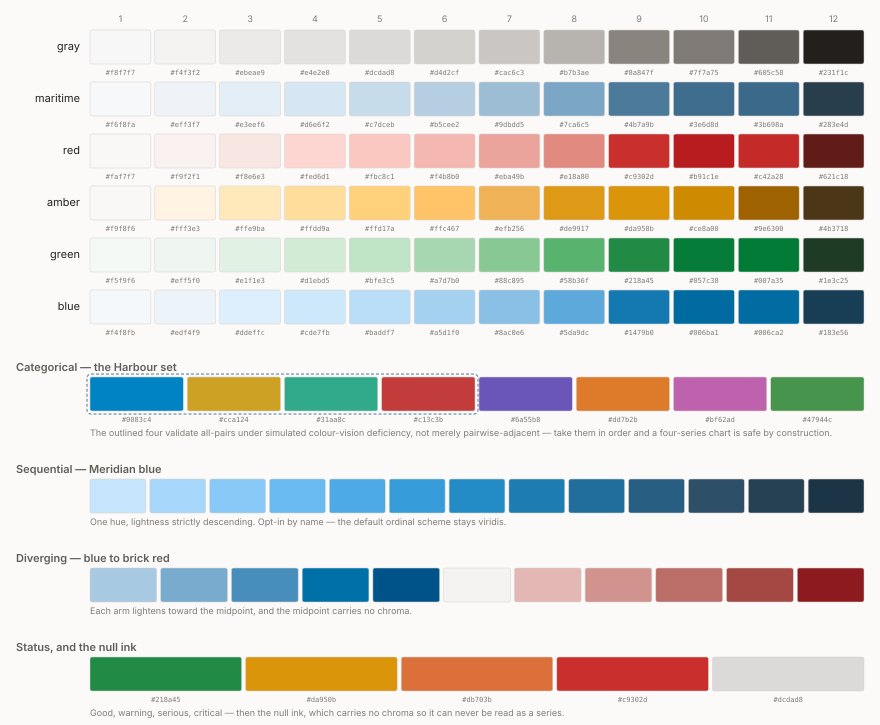

<!-- Generated by meridian-design — do not edit by hand. -->
<!-- Regenerate: cargo run --example dump_md > ../reference/tokens.md -->

# Token reference

Every value this design system defines, in both themes, generated from the crate. Nothing here is typed by hand: the tables are rendered from the same `emit::tokens_css()` the web consumes, so a value on this page and a value in production cannot disagree. Colours are sRGB hex, the sRGB conversion of an OKLCH design (ADR 0008); dimensions are logical pixels.

<picture>
  <source media="(prefers-color-scheme: dark)" srcset="palette_dark.svg">
  
</picture>

That sheet is generated from these same values — GitHub renders no colour swatch for a hex code in a repository file, so the picture is SVG and the tables below are the numbers. For the reasoning rather than either, read `guidelines/`; for the decisions, `decisions/`.

## Brand

Maritime, the signature. It appears on what the reader can act on or has selected, and never tints static chrome — see `guidelines/identity.md`.

| Token | Value |
|---|---|
| `--meridian-maritime` | `#4b7a9b` |

## Colour scales

Six 12-step ramps with Radix step semantics: 1–2 backgrounds, 3–5 component fills, 6–8 borders, 9–10 solid fills, 11–12 text. Dark is derived from the same construction with identical step meanings, never a naive inversion.

#### Light

| Step | gray | maritime | red | amber | green | blue |
|---|---|---|---|---|---|---|
| 1 | `#f8f7f7` | `#f6f8fa` | `#faf7f7` | `#f9f8f6` | `#f5f9f6` | `#f4f8fb` |
| 2 | `#f4f3f2` | `#eff3f7` | `#f9f2f1` | `#fff3e3` | `#eff5f0` | `#edf4f9` |
| 3 | `#ebeae9` | `#e3eef6` | `#f8e6e3` | `#ffe9ba` | `#e1f1e3` | `#ddeffc` |
| 4 | `#e4e2e0` | `#d6e6f2` | `#fed6d1` | `#ffdd9a` | `#d1ebd5` | `#cde7fb` |
| 5 | `#dcdad8` | `#c7dceb` | `#fbc8c1` | `#ffd17a` | `#bfe3c5` | `#baddf7` |
| 6 | `#d4d2cf` | `#b5cee2` | `#f4b8b0` | `#ffc467` | `#a7d7b0` | `#a5d1f0` |
| 7 | `#cac6c3` | `#9dbdd5` | `#eba49b` | `#efb256` | `#88c895` | `#8ac0e6` |
| 8 | `#b7b3ae` | `#7ca6c5` | `#e18a80` | `#de9917` | `#58b36f` | `#5da9dc` |
| 9 | `#8a847f` | `#4b7a9b` | `#c9302d` | `#da950b` | `#218a45` | `#1479b0` |
| 10 | `#7f7a75` | `#3e6d8d` | `#b91c1e` | `#ce8a00` | `#057c38` | `#006ba1` |
| 11 | `#605c58` | `#3b698a` | `#c42a28` | `#9e6300` | `#007a35` | `#006ca2` |
| 12 | `#231f1c` | `#283e4d` | `#621c18` | `#4b3718` | `#1e3c25` | `#183e56` |

#### Dark

| Step | gray | maritime | red | amber | green | blue |
|---|---|---|---|---|---|---|
| 1 | `#0d0c0c` | `#080d12` | `#130a09` | `#0f0c08` | `#070f08` | `#040e16` |
| 2 | `#191817` | `#12191e` | `#21110f` | `#1b1711` | `#111a12` | `#0b1a25` |
| 3 | `#232221` | `#172835` | `#410a09` | `#2b2011` | `#142b19` | `#04293f` |
| 4 | `#2a2928` | `#1b3547` | `#590001` | `#3a2709` | `#0c3d1c` | `#003755` |
| 5 | `#32302f` | `#244256` | `#6c0004` | `#47300a` | `#0f4b23` | `#004568` |
| 6 | `#3c3a38` | `#2f5068` | `#7f0f11` | `#563c13` | `#125b2b` | `#0a547c` |
| 7 | `#4a4744` | `#3c627d` | `#9a211f` | `#6a4c1d` | `#136c33` | `#146694` |
| 8 | `#64605c` | `#4a799a` | `#c62d2b` | `#886122` | `#0e7f3b` | `#177bb2` |
| 9 | `#716c67` | `#4b7a9b` | `#c9302d` | `#da950b` | `#218a45` | `#1479b0` |
| 10 | `#7e7a75` | `#466c87` | `#b91c1e` | `#ce8a00` | `#057c38` | `#1c6b99` |
| 11 | `#b7b2ae` | `#8fc1e4` | `#ff9083` | `#ebb15b` | `#6fd087` | `#78c3f7` |
| 12 | `#efeeec` | `#cde8fc` | `#ffcec6` | `#f9e1c1` | `#aaf7ba` | `#c9edff` |

## Chart palettes

The categorical set is ordered so the first four validate all-pairs under simulated colour-vision deficiency, not merely pairwise-adjacent — take them in order and a four-series chart is safe by construction. The sequential and diverging ramps and the status quartet are mode-invariant: a data ramp is the same ramp in either theme.

| Token | Light | Dark |
|---|---|---|
| `--m-cat-1` | `#0083c4` | `#0b89c8` |
| `--m-cat-2` | `#cca124` | `#b68f1b` |
| `--m-cat-3` | `#31aa8c` | `#31aa8c` |
| `--m-cat-4` | `#c13c3b` | `#c74b47` |
| `--m-cat-5` | `#6a55b8` | `#7b69c6` |
| `--m-cat-6` | `#dd7b2b` | `#b45c03` |
| `--m-cat-7` | `#bf62ad` | `#b55fa4` |
| `--m-cat-8` | `#47944c` | `#47944c` |
| `--m-div-mid` | `#f4f3f2` | `#2a2928` |
| `--m-seq-100` | `#c6e4fb` | — |
| `--m-seq-150` | `#a6d7fa` | — |
| `--m-seq-200` | `#87c8f6` | — |
| `--m-seq-250` | `#69baf0` | — |
| `--m-seq-300` | `#4daae6` | — |
| `--m-seq-350` | `#359bd9` | — |
| `--m-seq-400` | `#238cc7` | — |
| `--m-seq-450` | `#1d7cb2` | — |
| `--m-seq-500` | `#216d9b` | — |
| `--m-seq-550` | `#285e81` | — |
| `--m-seq-600` | `#2d4f67` | — |
| `--m-seq-650` | `#274154` | — |
| `--m-seq-700` | `#1b3546` | — |
| `--m-div-blue-1` | `#005389` | — |
| `--m-div-blue-2` | `#0070a9` | — |
| `--m-div-blue-3` | `#478ebc` | — |
| `--m-div-blue-4` | `#79abcf` | — |
| `--m-div-blue-5` | `#a8c9e2` | — |
| `--m-div-red-1` | `#e3b8b4` | — |
| `--m-div-red-2` | `#d0938d` | — |
| `--m-div-red-3` | `#bb6d67` | — |
| `--m-div-red-4` | `#a54743` | — |
| `--m-div-red-5` | `#8d1a1e` | — |
| `--m-null-ink` | `#dcdad8` | `#32302f` |
| `--m-status-good` | `#218a45` | — |
| `--m-status-warning` | `#da950b` | — |
| `--m-status-serious` | `#db703b` | — |
| `--m-status-critical` | `#c9302d` | — |

A dash means the dark block does not redefine the token and the light value stands — the web artefact leans on the cascade for that, so a value appearing once is a decision rather than an omission.

## Chart ink

What a chart is drawn *on* and *with*, as distinct from what it plots. The renderer reads these directly; they are the one place chrome and canvas meet.

| Token | Light | Dark |
|---|---|---|
| `--m-surface` | `#fcfcfb` | `#161413` |
| `--m-page` | `#fbfaf9` | `#0e0c0b` |
| `--m-ink` | `#231f1c` | `#efeeec` |
| `--m-ink-secondary` | `#605c58` | `#b7b2ae` |
| `--m-ink-muted` | `#8a847f` | `#716c67` |
| `--m-gridline` | `#ebeae9` | `#232221` |
| `--m-baseline` | `#d4d2cf` | `#3c3a38` |
| `--m-focus` | `#4b7a9b` | `#8fc1e4` |

## Surfaces, borders and text

The semantic layer: what a colour is *for*, framework-neutral. Reach for these before dropping to a raw scale — and if the thing being coloured has no semantic name yet, the fix is usually to give it one.

| Token | Light | Dark |
|---|---|---|
| `--m-surface-app` | `#fbfaf9` | `#0e0c0b` |
| `--m-surface-raised` | `#fcfcfb` | `#161413` |
| `--m-surface-sunken` | `#f4f3f2` | `#191817` |
| `--m-surface-overlay` | `#fcfcfb` | `#232221` |
| `--m-surface-sidebar` | `#f8f7f7` | `#0d0c0c` |
| `--m-surface-header` | `#f4f3f2` | `#191817` |
| `--m-surface-scrim` | `#231f1c33` | `#00000066` |
| `--m-border-subtle` | `#d4d2cf` | `#3c3a38` |
| `--m-border-default` | `#cac6c3` | `#4a4744` |
| `--m-border-strong` | `#b7b3ae` | `#64605c` |
| `--m-border-control` | `#8a847f` | `#7e7a75` |
| `--m-border-focus` | `#4b7a9b` | `#8fc1e4` |
| `--m-border-divider` | `#ebeae9` | `#232221` |
| `--m-text-primary` | `#231f1c` | `#efeeec` |
| `--m-text-secondary` | `#605c58` | `#b7b2ae` |
| `--m-text-muted` | `#7f7a75` | `#7e7a75` |
| `--m-text-placeholder` | `#8a847f` | `#716c67` |
| `--m-text-disabled` | `#b7b3ae` | `#64605c` |
| `--m-text-on-solid` | `#fcfcfb` | `#fcfcfb` |
| `--m-text-on-solid-bright` | `#231f1c` | `#231f1c` |
| `--m-text-link` | `#3b698a` | `#8fc1e4` |
| `--m-text-link-hover` | `#283e4d` | `#cde8fc` |
| `--m-text-link-active` | `#283e4d` | `#cde8fc` |

## Interaction roles

Six roles, three channels each, six states each: interaction state is a token slot here rather than a cascade, so a consumer never computes a hover colour. `focus` repeats `base` deliberately — the ring carries focus, not a fill change.

#### `neutral`

| State | Light bg | Light fg | Light border | Dark bg | Dark fg | Dark border |
|---|---|---|---|---|---|---|
| base | `#f4f3f2` | `#231f1c` | `#cac6c3` | `#191817` | `#efeeec` | `#4a4744` |
| hover | `#ebeae9` | `#231f1c` | `#b7b3ae` | `#232221` | `#efeeec` | `#64605c` |
| active | `#e4e2e0` | `#231f1c` | `#8a847f` | `#2a2928` | `#efeeec` | `#7e7a75` |
| selected | `#e3eef6` | `#231f1c` | `#b5cee2` | `#172835` | `#efeeec` | `#2f5068` |
| focus | `#f4f3f2` | `#231f1c` | `#4b7a9b` | `#191817` | `#efeeec` | `#8fc1e4` |
| disabled | `#f4f3f2` | `#7f7a75` | `#dcdad8` | `#191817` | `#7e7a75` | `#32302f` |

#### `accent`

| State | Light bg | Light fg | Light border | Dark bg | Dark fg | Dark border |
|---|---|---|---|---|---|---|
| base | `#3e6d8d` | `#fcfcfb` | `#3e6d8d` | `#466c87` | `#fcfcfb` | `#466c87` |
| hover | `#3b698a` | `#fcfcfb` | `#3b698a` | `#4a799a` | `#fcfcfb` | `#4a799a` |
| active | `#283e4d` | `#fcfcfb` | `#283e4d` | `#3c627d` | `#fcfcfb` | `#3c627d` |
| selected | `#283e4d` | `#fcfcfb` | `#b5cee2` | `#3c627d` | `#fcfcfb` | `#2f5068` |
| focus | `#3e6d8d` | `#fcfcfb` | `#4b7a9b` | `#466c87` | `#fcfcfb` | `#8fc1e4` |
| disabled | `#dcdad8` | `#7f7a75` | `#dcdad8` | `#32302f` | `#7e7a75` | `#32302f` |

#### `danger`

| State | Light bg | Light fg | Light border | Dark bg | Dark fg | Dark border |
|---|---|---|---|---|---|---|
| base | `#c9302d` | `#fcfcfb` | `#c9302d` | `#c9302d` | `#fcfcfb` | `#c9302d` |
| hover | `#b91c1e` | `#fcfcfb` | `#b91c1e` | `#b91c1e` | `#fcfcfb` | `#b91c1e` |
| active | `#621c18` | `#fcfcfb` | `#621c18` | `#9a211f` | `#fcfcfb` | `#9a211f` |
| selected | `#621c18` | `#fcfcfb` | `#f4b8b0` | `#9a211f` | `#fcfcfb` | `#7f0f11` |
| focus | `#c9302d` | `#fcfcfb` | `#4b7a9b` | `#c9302d` | `#fcfcfb` | `#8fc1e4` |
| disabled | `#dcdad8` | `#7f7a75` | `#dcdad8` | `#32302f` | `#7e7a75` | `#32302f` |

#### `success`

| State | Light bg | Light fg | Light border | Dark bg | Dark fg | Dark border |
|---|---|---|---|---|---|---|
| base | `#057c38` | `#fcfcfb` | `#057c38` | `#057c38` | `#fcfcfb` | `#057c38` |
| hover | `#007a35` | `#fcfcfb` | `#007a35` | `#0e7f3b` | `#fcfcfb` | `#0e7f3b` |
| active | `#1e3c25` | `#fcfcfb` | `#1e3c25` | `#136c33` | `#fcfcfb` | `#136c33` |
| selected | `#1e3c25` | `#fcfcfb` | `#a7d7b0` | `#136c33` | `#fcfcfb` | `#125b2b` |
| focus | `#057c38` | `#fcfcfb` | `#4b7a9b` | `#057c38` | `#fcfcfb` | `#8fc1e4` |
| disabled | `#dcdad8` | `#7f7a75` | `#dcdad8` | `#32302f` | `#7e7a75` | `#32302f` |

#### `warning`

| State | Light bg | Light fg | Light border | Dark bg | Dark fg | Dark border |
|---|---|---|---|---|---|---|
| base | `#da950b` | `#231f1c` | `#da950b` | `#da950b` | `#231f1c` | `#da950b` |
| hover | `#de9917` | `#231f1c` | `#de9917` | `#ebb15b` | `#231f1c` | `#ebb15b` |
| active | `#ce8a00` | `#231f1c` | `#ce8a00` | `#ce8a00` | `#231f1c` | `#ce8a00` |
| selected | `#ce8a00` | `#231f1c` | `#ffc467` | `#ce8a00` | `#231f1c` | `#563c13` |
| focus | `#da950b` | `#231f1c` | `#4b7a9b` | `#da950b` | `#231f1c` | `#8fc1e4` |
| disabled | `#dcdad8` | `#7f7a75` | `#dcdad8` | `#32302f` | `#7e7a75` | `#32302f` |

#### `info`

| State | Light bg | Light fg | Light border | Dark bg | Dark fg | Dark border |
|---|---|---|---|---|---|---|
| base | `#1479b0` | `#fcfcfb` | `#1479b0` | `#1479b0` | `#fcfcfb` | `#1479b0` |
| hover | `#006ba1` | `#fcfcfb` | `#006ba1` | `#1c6b99` | `#fcfcfb` | `#1c6b99` |
| active | `#183e56` | `#fcfcfb` | `#183e56` | `#146694` | `#fcfcfb` | `#146694` |
| selected | `#183e56` | `#fcfcfb` | `#a5d1f0` | `#146694` | `#fcfcfb` | `#0a547c` |
| focus | `#1479b0` | `#fcfcfb` | `#4b7a9b` | `#1479b0` | `#fcfcfb` | `#8fc1e4` |
| disabled | `#dcdad8` | `#7f7a75` | `#dcdad8` | `#32302f` | `#7e7a75` | `#32302f` |

## Component surfaces

Named parts that earn their own slots because two consumers both need them and neither should invent them. Only the two planes above the working plane cast a shadow, which is why there are two shadow tokens and not four.

| Token | Light | Dark |
|---|---|---|
| `--m-rows-bg` | `#fcfcfb` | `#161413` |
| `--m-rows-head-bg` | `#f4f3f2` | `#191817` |
| `--m-rows-head-fg` | `#605c58` | `#b7b2ae` |
| `--m-rows-foot-bg` | `#f4f3f2` | `#191817` |
| `--m-rows-foot-fg` | `#605c58` | `#b7b2ae` |
| `--m-rows-stripe-bg` | `#f8f7f7` | `#0d0c0c` |
| `--m-rows-hover-bg` | `#ebeae9` | `#232221` |
| `--m-rows-selected-bg` | `#e3eef6` | `#172835` |
| `--m-rows-selected-border` | `#b5cee2` | `#2f5068` |
| `--m-rows-border` | `#ebeae9` | `#232221` |
| `--m-tabs-bar-bg` | `#f4f3f2` | `#191817` |
| `--m-tabs-segmented-bg` | `#ebeae9` | `#232221` |
| `--m-tabs-bg` | `#f4f3f2` | `#191817` |
| `--m-tabs-fg` | `#605c58` | `#b7b2ae` |
| `--m-tabs-active-bg` | `#fcfcfb` | `#161413` |
| `--m-tabs-active-fg` | `#231f1c` | `#efeeec` |
| `--m-scrollbar-track` | `#f4f3f2` | `#191817` |
| `--m-scrollbar-thumb` | `#d4d2cf` | `#3c3a38` |
| `--m-scrollbar-thumb-hover` | `#cac6c3` | `#4a4744` |
| `--m-editor-caret` | `#231f1c` | `#efeeec` |
| `--m-editor-selection` | `#d6e6f2` | `#172835` |
| `--m-drop-target` | `#4b7a9b26` | `#4b7a9b26` |
| `--m-drag-border` | `#7ca6c5` | `#4a799a` |
| `--m-skeleton` | `#ebeae9` | `#232221` |
| `--m-progress-track` | `#dcdad8` | `#32302f` |
| `--m-progress-bar` | `#3e6d8d` | `#466c87` |
| `--m-slider-track` | `#dcdad8` | `#32302f` |
| `--m-slider-thumb` | `#3e6d8d` | `#466c87` |
| `--m-sidebar-bg` | `#f8f7f7` | `#0d0c0c` |
| `--m-sidebar-border` | `#d4d2cf` | `#3c3a38` |
| `--m-title-bar-bg` | `#fbfaf9` | `#0e0c0b` |
| `--m-status-bar-bg` | `#fbfaf9` | `#0e0c0b` |
| `--m-tiles-bg` | `#fbfaf9` | `#0e0c0b` |
| `--m-group-box-bg` | `#f4f3f2` | `#191817` |
| `--m-group-box-title-fg` | `#605c58` | `#b7b2ae` |
| `--m-description-label-bg` | `#f4f3f2` | `#191817` |
| `--m-description-label-fg` | `#605c58` | `#b7b2ae` |
| `--m-accordion-bg` | `#fcfcfb` | `#161413` |
| `--m-accordion-hover-bg` | `#ebeae9` | `#232221` |
| `--m-popover-bg` | `#fcfcfb` | `#232221` |
| `--m-window-border` | `#d4d2cf` | `#3c3a38` |
| `--m-shadow-overlay` | `0px 2px 8px #231f1c1f` | `0px 2px 8px #00000066` |
| `--m-shadow-modal` | `0px 8px 24px #231f1c29` | `0px 8px 24px #0000008c` |

## Box model

Stated once, in logical pixels, and mode-invariant throughout. The spacing ladder is the only one whose index is genuinely its name: `--m-space-4` is the fourth rung.

| Token | Value |
|---|---|
| `--m-radius-none` | `0px` |
| `--m-radius-chip` | `3px` |
| `--m-radius-control` | `6px` |
| `--m-radius-panel` | `8px` |
| `--m-radius-full` | `9999px` |
| `--m-space-0` | `0px` |
| `--m-space-1` | `2px` |
| `--m-space-2` | `4px` |
| `--m-space-3` | `6px` |
| `--m-space-4` | `8px` |
| `--m-space-5` | `12px` |
| `--m-space-6` | `16px` |
| `--m-space-7` | `24px` |
| `--m-space-8` | `32px` |
| `--m-space-9` | `48px` |
| `--m-panel-padding` | `12px` |
| `--m-section-gap` | `16px` |
| `--m-pane-gap` | `24px` |
| `--m-icon-label-gap` | `6px` |
| `--m-control-gap` | `8px` |
| `--m-modal-padding` | `16px` |
| `--m-modal-width-narrow` | `480px` |
| `--m-modal-width-default` | `560px` |
| `--m-row-dense` | `20px` |
| `--m-row-grid` | `24px` |
| `--m-row-preview` | `36px` |
| `--m-row-comfortable` | `46px` |
| `--m-control-xs` | `18px` |
| `--m-control-sm` | `20px` |
| `--m-control-md` | `24px` |
| `--m-control-lg` | `30px` |
| `--m-icon-xs` | `12px` |
| `--m-icon-sm` | `14px` |
| `--m-icon-md` | `16px` |
| `--m-icon-lg` | `20px` |
| `--m-icon-xl` | `24px` |
| `--m-focus-ring-width` | `2px` |
| `--m-focus-ring-offset` | `1px` |
| `--m-focus-ring-inset` | `1px` |
| `--m-focus-ring-bleed` | `3px` |

## Type and motion

Two faces and two sizes: this is a dense data system, not a marketing site, and the display face is deliberately absent from the app artefact. The motion budget is two numbers because `guidelines/speed.md` allows two — a spatial move and a state change — and nothing decorative.

| Token | Value |
|---|---|
| `--m-font-sans` | `"Inter"` |
| `--m-font-mono` | `"JetBrains Mono"` |
| `--m-font-size-ui` | `12px` |
| `--m-font-size-chart` | `11px` |
| `--m-motion-spatial` | `150ms` |
| `--m-motion-animation-time` | `0.12s` |

## Measured contrast

Every ratio below is computed by `validate::contrast` — WCAG 2.x relative luminance, the method ADRs 0006 and 0007 settle for this system — and every one of them is a pair `tests/chrome_gate.rs` or `tests/palette_gate.rs` already holds to a floor. Nothing measured here is unguarded, because a number published without a gate behind it is a claim that can quietly stop being true. The floors are `4.5` for text that carries meaning and for ink on a solid, and `3` for non-text boundaries and quiet ink.

### Text ink — light mode

| Slot | Floor | app | raised | sunken | overlay | sidebar | header |
|---|---|---|---|---|---|---|---|
| primary | 4.5 | 15.69 | 15.93 | 14.76 | 15.93 | 15.29 | 14.76 |
| secondary | 4.5 | 6.36 | 6.45 | 5.98 | 6.45 | 6.20 | 5.98 |
| link | 4.5 | 5.64 | 5.72 | 5.30 | 5.72 | 5.50 | 5.30 |
| link-hover | 4.5 | 10.68 | 10.84 | 10.04 | 10.84 | 10.41 | 10.04 |
| link-active | 4.5 | 10.68 | 10.84 | 10.04 | 10.84 | 10.41 | 10.04 |
| muted | 3 | 4.08 | 4.14 | 3.83 | 4.14 | 3.97 | 3.83 |
| placeholder | 3 | 3.54 | 3.60 | 3.33 | 3.60 | 3.45 | 3.33 |
| disabled | exempt | 2.00 | 2.03 | 1.88 | 2.03 | 1.95 | 1.88 |

### Text ink — dark mode

| Slot | Floor | app | raised | sunken | overlay | sidebar | header |
|---|---|---|---|---|---|---|---|
| primary | 4.5 | 16.83 | 15.84 | 15.29 | 13.70 | 16.85 | 15.29 |
| secondary | 4.5 | 9.29 | 8.74 | 8.44 | 7.56 | 9.30 | 8.44 |
| link | 4.5 | 10.14 | 9.55 | 9.22 | 8.26 | 10.15 | 9.22 |
| link-hover | 4.5 | 15.37 | 14.47 | 13.97 | 12.51 | 15.39 | 13.97 |
| link-active | 4.5 | 15.37 | 14.47 | 13.97 | 12.51 | 15.39 | 13.97 |
| muted | 3 | 4.58 | 4.31 | 4.16 | 3.73 | 4.58 | 4.16 |
| placeholder | 3 | 3.76 | 3.54 | 3.41 | 3.06 | 3.76 | 3.41 |
| disabled | exempt | 3.13 | 2.95 | 2.85 | 2.55 | 3.13 | 2.85 |

`disabled` carries no floor because WCAG exempts disabled controls; the gate holds it to rank order instead — quieter than `placeholder`, and never louder than the slot above it.

### Ink on a solid

A role's foreground against its own background, floor `4.5`. The `focus` state repeats `base` by construction and `disabled` is exempt, so neither is gated and neither is printed.

| Role | Light base | Light hover | Light active | Light selected | Dark base | Dark hover | Dark active | Dark selected |
|---|---|---|---|---|---|---|---|---|
| `neutral` | 14.76 | 13.61 | 12.66 | 13.88 | 15.29 | 13.70 | 12.52 | 13.02 |
| `accent` | 5.42 | 5.72 | 10.84 | 10.84 | 5.45 | 4.55 | 6.32 | 6.32 |
| `danger` | 5.19 | 6.30 | 12.04 | 12.04 | 5.19 | 6.30 | 7.83 | 7.83 |
| `success` | 5.18 | 5.33 | 11.84 | 11.84 | 5.18 | 4.97 | 6.35 | 6.35 |
| `warning` | 6.45 | 6.75 | 5.65 | 5.65 | 6.45 | 8.54 | 5.65 | 5.65 |
| `info` | 4.66 | 5.65 | 10.98 | 10.98 | 4.66 | 5.66 | 6.09 | 6.09 |

### Findable boundaries

The line that identifies a control, and the ring that says where focus is. Floor `3` on every surface either can be drawn over.

#### Light

| Token | app | raised | sunken | overlay | sidebar | header |
|---|---|---|---|---|---|---|
| `--m-border-control` | 3.54 | 3.60 | 3.33 | 3.60 | 3.45 | 3.33 |
| `--m-border-focus` | 4.42 | 4.49 | 4.16 | 4.49 | 4.31 | 4.16 |

#### Dark

| Token | app | raised | sunken | overlay | sidebar | header |
|---|---|---|---|---|---|---|
| `--m-border-control` | 4.58 | 4.31 | 4.16 | 3.73 | 4.58 | 4.16 |
| `--m-border-focus` | 10.14 | 9.55 | 9.22 | 8.26 | 10.15 | 9.22 |

### Chart series on the chart surface

Floor `3`, with three deliberate exceptions. Gold, teal and orange sit in a documented relief band between 2 and 3 — the gate holds them *inside* that band from both sides, so drifting up out of it fails just as loudly as drifting down. They are legible because a chart labels its series directly, not because the fill clears a text floor.

| Slot | Light | Dark |
|---|---|---|
| `--m-cat-1` | 4.06 | 4.75 |
| `--m-cat-2` | 2.35 (relief) | 6.06 |
| `--m-cat-3` | 2.82 (relief) | 6.35 |
| `--m-cat-4` | 5.14 | 3.96 |
| `--m-cat-5` | 5.68 | 4.09 |
| `--m-cat-6` | 2.95 (relief) | 3.91 |
| `--m-cat-7` | 3.68 | 4.49 |
| `--m-cat-8` | 3.65 | 4.90 |

## Density bindings

A row rung is not a height on its own — it binds a control height, an icon size, a text size and a padding pair that were chosen together. `tokens.css` emits the rungs as separate custom properties because CSS has no way to say they travel as a set; this is the set.

| Rung | Row | Control | Icon | Text | Pad x | Pad y |
|---|---|---|---|---|---|---|
| dense | 20px | 18px | 14px | 12px | 6px | 1px |
| grid | 24px | 20px | 14px | 12px | 8px | 2px |
| preview | 36px | 24px | 16px | 12px | 8px | 6px |
| comfortable | 46px | 30px | 20px | 12px | 12px | 8px |

## OpenType features

Carried as `(tag, value)` pairs rather than a CSS string, because the desktop needs them as font features and the web needs them as `font-feature-settings` — one representation, two spellings downstream.

| Feature | Tag | Value | Applies to |
|---|---|---|---|
| `TNUM` | `tnum` | 1 | Tabular figures — every numeric column. |
| `ZERO` | `zero` | 1 | Slashed zero, alongside tabular figures. |
| `CALT_OFF` | `calt` | 0 | Contextual alternates **off** — required on data surfaces, where the mono face's ligatures would fuse characters that must stay countable. |

## Keyboard and role contract

The half of a component spec colour tokens cannot carry: what a widget is, whether it takes focus, and which key intents it must answer. Generated from `a11y.rs`, where the enum, the roster and the name table come from one list precisely so a new widget cannot escape the tables that iterate it.

| Widget | ARIA role | Focus | Tab stop | Key intents |
|---|---|---|---|---|
| `Button` | `button` | tab | yes | `activate` |
| `Link` | `link` | tab | yes | `activate` |
| `Checkbox` | `checkbox` | tab | yes | `toggle` |
| `Radio` | `radio` | tab | yes | `activate`, `move-prev`, `move-next` |
| `Switch` | `switch` | tab | yes | `toggle` |
| `Tab` | `tab` | roving | no | `activate`, `move-prev`, `move-next` |
| `TabList` | `tablist` | tab | yes | `move-prev`, `move-next`, `move-first`, `move-last` |
| `MenuItem` | `menuitem` | roving | no | `activate` |
| `Menu` | `menu` | tab | yes | `move-prev`, `move-next`, `move-first`, `move-last`, `activate`, `dismiss` |
| `ComboBox` | `combobox` | tab | yes | `expand`, `activate`, `move-prev`, `move-next`, `dismiss` |
| `ListBox` | `listbox` | tab | yes | `move-prev`, `move-next`, `move-first`, `move-last`, `activate`, `dismiss` |
| `Option_` | `option` | roving | no | `activate` |
| `TextBox` | `textbox` | tab | yes | `commit`, `dismiss` |
| `Slider` | `slider` | tab | yes | `decrement`, `increment`, `move-first`, `move-last` |
| `ProgressBar` | `progressbar` | never | no | — |
| `Grid` | `grid` | tab | yes | `move-prev`, `move-next`, `move-up`, `move-down`, `move-first`, `move-last`, `page-up`, `page-down`, `activate`, `extend` |
| `GridCell` | `gridcell` | roving | no | `move-prev`, `move-next`, `move-up`, `move-down`, `move-first`, `move-last`, `page-up`, `page-down`, `activate`, `extend` |
| `ColumnHeader` | `columnheader` | roving | no | `activate` |
| `Row` | `row` | roving | no | `activate`, `extend` |
| `Dialog` | `dialog` | tab | yes | `dismiss`, `commit` |
| `Tooltip` | `tooltip` | never | no | — |
| `Status` | `status` | never | no | — |
| `Alert` | `alert` | never | no | — |
| `Separator` | `separator` | never | no | — |
| `Toolbar` | `toolbar` | tab | yes | `move-prev`, `move-next`, `move-first`, `move-last` |

